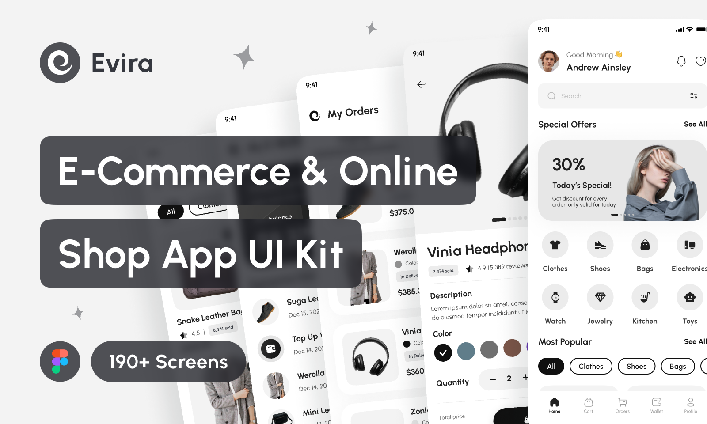
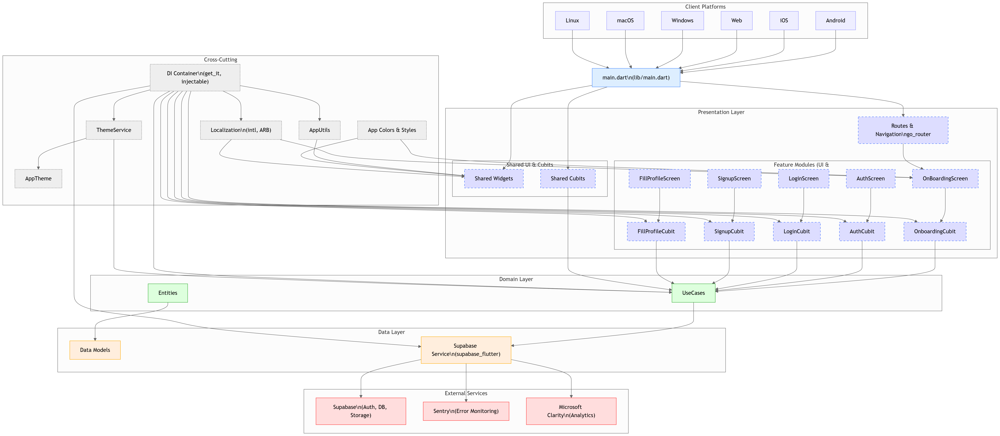
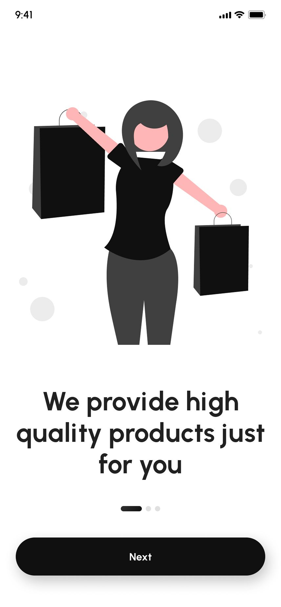
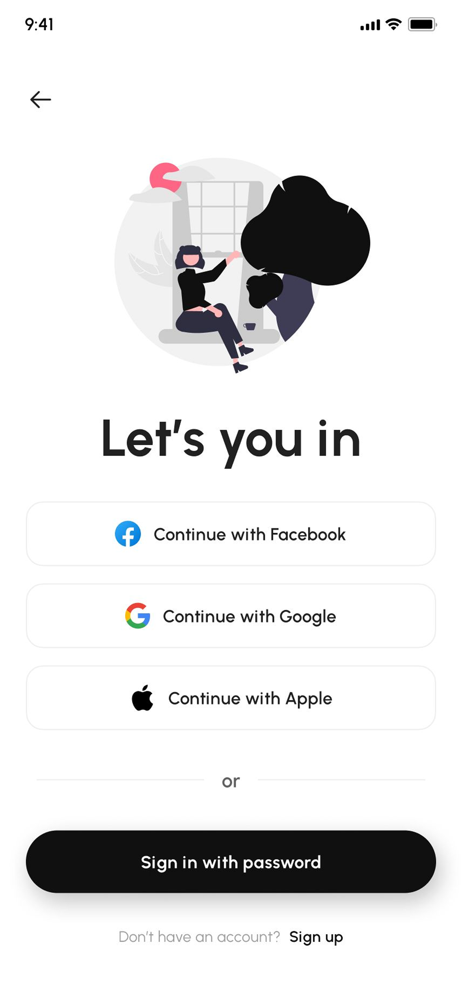
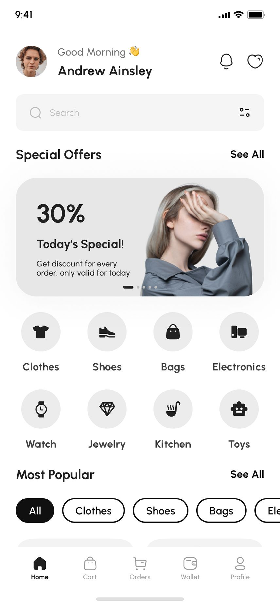
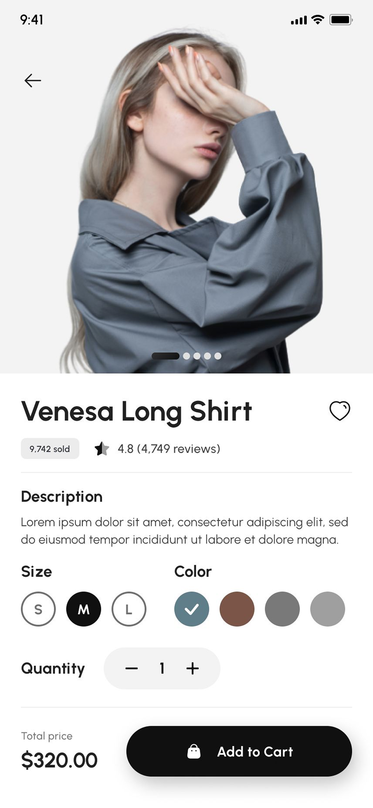
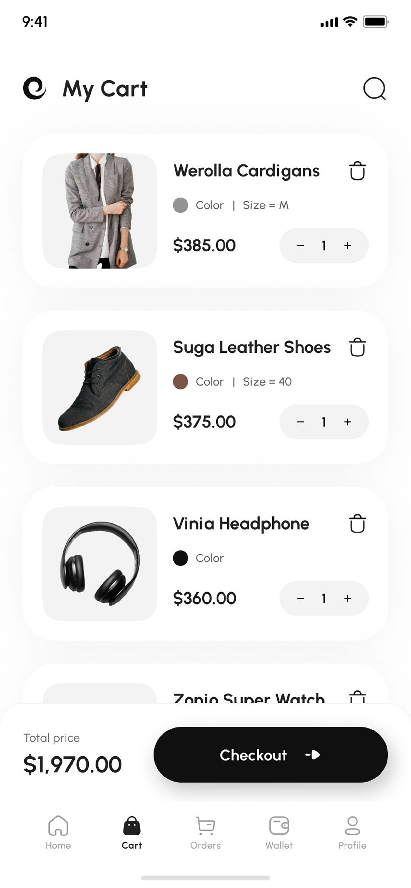
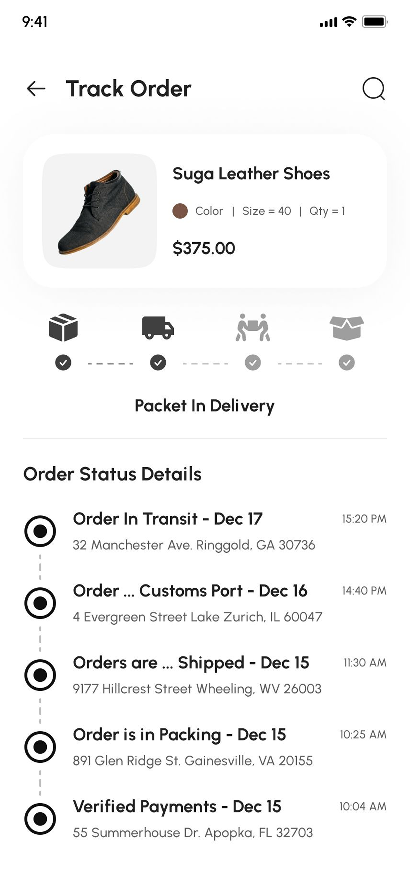
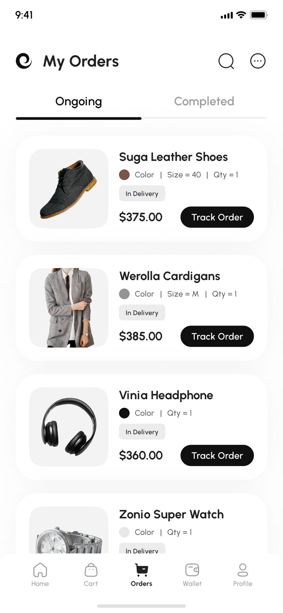
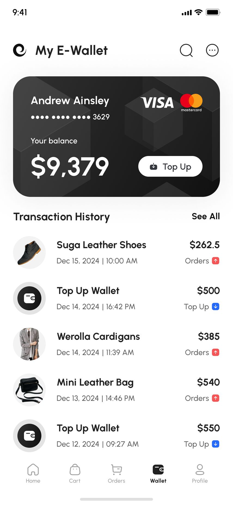

[](https://www.figma.com/community/file/1216043752712853958/evira-e-commerce-online-shop-app-ui-kit)

---

## ✨ Badges


---


# 🛍️ Evira E-Commerce App

**Evira** is a premium **Flutter E-Commerce & Online Shopping app** built with **Bloc**, **Supabase**, and **Clean Architecture**.  
It delivers a complete and modern shopping experience — from product discovery and filtering to checkout, wallet payments, and order tracking — all with elegant light and dark themes.  

📱 Designed for performance, scalability, and beautiful UI across Android devices.  
⭐ Built with over **190+ responsive screens** and crafted for developers who want a ready-to-use, production-quality Flutter E-Commerce template.  


---

> ⚠️ **Project Status: In Development**  
>
> This project is still under active development.  
> Features, structure, and dependencies may change frequently until a stable release is published.  
> Contributions and feedback are always welcome!

---


## 🚀 Features

- 🎨 **Premium & Modern UI** with 190+ responsive screens  
- 🌗 **Light & Dark Theme** support  
- 🛒 **Complete Shopping Flow** – Wishlist, Cart, Checkout, and Order Tracking  
- 🔍 **Smart Product Search & Filters** with categories and reviews  
- 💳 **Secure Multiple Payment Methods** with promo & discount offers  
- 👛 **Integrated E-Wallet** – Top-Up, Transaction History & E-Receipts  
- 👤 **User Authentication** – Onboarding, Sign Up, Sign In, Forgot/Reset Password  
- 📦 **Shipping & Delivery Tracking** for orders  
- 🔔 **Notifications & Alerts** for updates and offers  
- ⚙️ **Profile & Settings Management** with account setup  
- 🛠️ **Fully Customizable Design System** with components, variants & auto layout  

---

## 📊 App Architecture



```plaintext
lib
├───core
│   ├───constants
│   ├───di
│   ├───enums
│   ├───extensions
│   ├───gen
│   ├───l10n
│   ├───lang_generated
│   │   └───intl
│   ├───routes
│   │   └───args
│   ├───services
│   ├───theme
│   └───utils
├───features
│   ├───create_new_password
│   │   └───ui
│   │       ├───dialogs
│   │       ├───screen
│   │       └───widgets
│   ├───create_pin
│   │   ├───data
│   │   │   └───repos
│   │   ├───domain
│   │   │   ├───repos
│   │   │   └───usecases
│   │   └───ui
│   │       ├───cubit
│   │       └───screen
│   ├───error
│   │   └───ui
│   │       └───screen
│   ├───fill_profile
│   │   ├───data
│   │   │   ├───models
│   │   │   └───repos
│   │   ├───domain
│   │   │   ├───entities
│   │   │   ├───repos
│   │   │   └───usecases
│   │   └───ui
│   │       ├───cubit
│   │       ├───screen
│   │       └───widgets
│   ├───forget_password
│   │   └───ui
│   │       ├───screens
│   │       └───widgets
│   ├───home
│   │   └───ui
│   │       └───screen
│   ├───login
│   │   ├───data
│   │   │   ├───models
│   │   │   └───repos
│   │   ├───domain
│   │   │   ├───entities
│   │   │   ├───repos
│   │   │   └───usecases
│   │   └───ui
│   │       ├───cubit
│   │       ├───screen
│   │       └───widgets
│   ├───no_internet
│   │   └───ui
│   │       └───screen
│   ├───onboarding
│   │   ├───data
│   │   │   ├───models
│   │   │   └───repos
│   │   ├───domain
│   │   │   ├───entities
│   │   │   ├───repos
│   │   │   └───usecases
│   │   └───ui
│   │       ├───cubit
│   │       ├───screen
│   │       └───widgets
│   ├───set_fingerprint
│   │   ├───data
│   │   │   └───repos
│   │   ├───domain
│   │   │   ├───repos
│   │   │   └───usecases
│   │   └───ui
│   │       ├───cubit
│   │       ├───dialogs
│   │       └───screen
│   ├───signup
│   │   ├───data
│   │   │   ├───models
│   │   │   └───repos
│   │   ├───domain
│   │   │   ├───entities
│   │   │   ├───repos
│   │   │   └───usecases
│   │   └───ui
│   │       ├───cubit
│   │       ├───screen
│   │       └───widgets
│   └───social_auth
│       ├───data
│       │   └───repos
│       ├───domain
│       │   ├───repos
│       │   └───usecases
│       └───ui
│           ├───cubit
│           ├───screen
│           └───widgets
└───shared
    ├───cubits
    ├───data
    │   ├───models
    │   └───repos
    ├───domain
    │   ├───repos
    │   └───usecases
    ├───mixins
    └───widgets
```
---


## 🚀 Getting Started

To run this app locally:

```bash
git clone https://github.com/TaylorBiehn/Evira-E-Commerce.git
cd Evira-E-Commerce
flutter pub get
flutter run
```

### 🎨 UI

---

### 📸 Screenshots

<p float="left">
  
  
  
  
  
  
  
  
</p>


---

### 🛠️ Contributions

Feel free to fork the repo, open issues, or submit PRs to improve the app!
